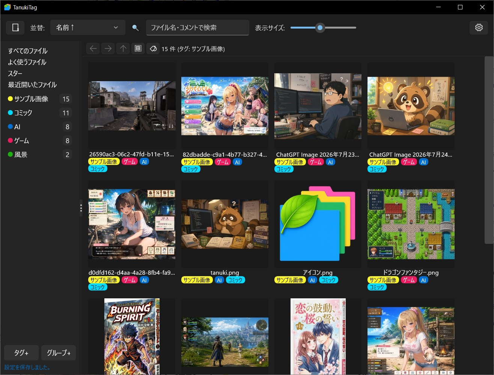
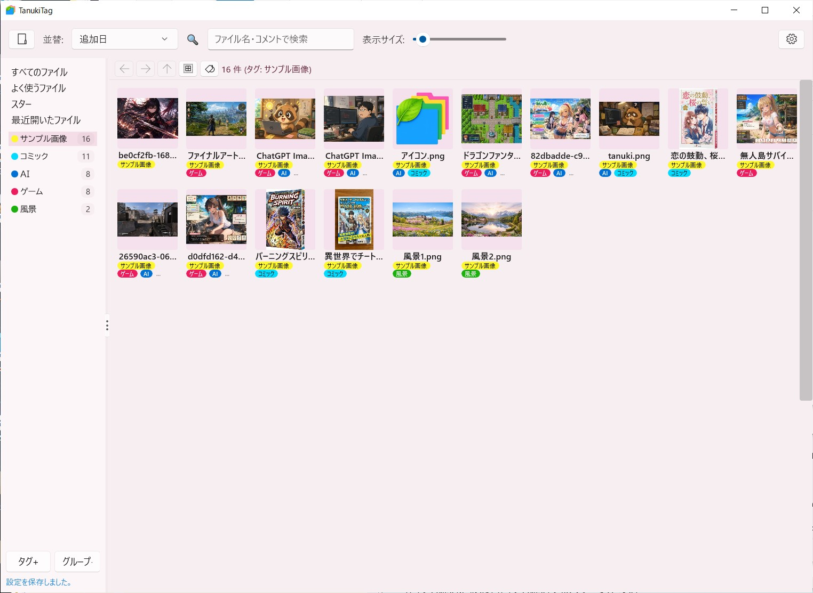
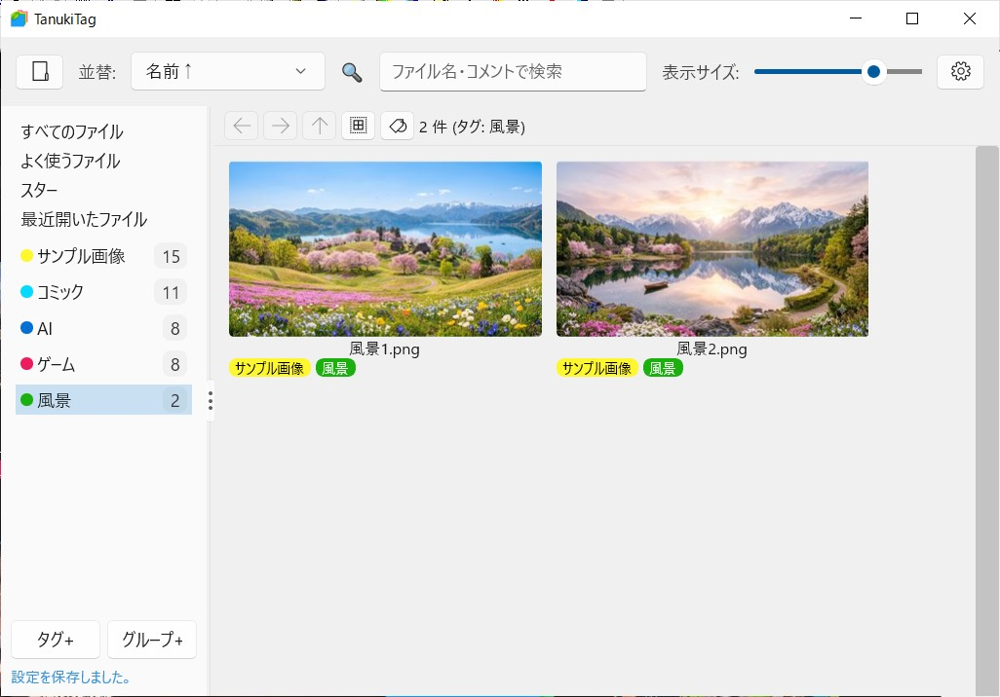
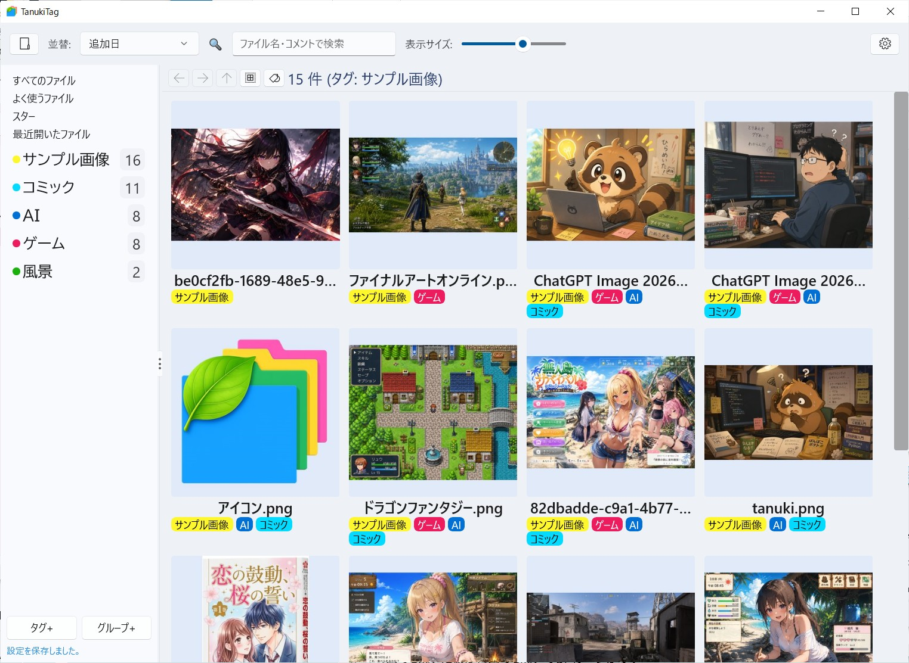

---

# TanukiTag

TanukiTagは、大量の画像・動画・ドキュメントを高速サムネイルと多彩なタグで直感的に整理・検索できるファイル管理ソフトです。
自動タグ付けやFFmpeg連携、フォント・UIの細かなカスタマイズに対応し、高速閲覧と自由度の高い分類を実現します。
※閲覧や再生は外部の既定アプリで行う設計のため、お気に入りのビューワーと組み合わせて快適に使えます。

### [**ダウンロード（GitHub Releases）**](https://github.com/usamijun785-byte/TanukiTag/releases)

## スクリーンショット
メイン画面（テーマダーク）

サムネ縮小、テーマ変更も出来ます（テーマパステルピンク）

動画向けにサムネグリッドのサイズを横長にも出来ます（テーマパステルライト）

フォントサイズ変更も可能です（テーマパステルブルー）

---

## 🌟 主な機能と特徴

### 1. サムネイル生成の高速性

* **高速デコーダー内蔵**: ネイティブ処理（`libjpeg-turbo` ベースの `FastJpegDecoder`）による縮小デコードを採用し、高解像度JPEGも一瞬で読み込みます。
* **データベースキャッシュ**: サムネイルをSQLite（WALモード）にまとめてキャッシュ化。I/O負荷を最小限に抑え、爆速表示を実現します。
* **FFmpeg連携（動画サムネイル）**:
* 動画のフレーム抽出には **FFmpeg** の使用を推奨します。
* **セットアップ方法**: [ffmpeg.org](https://ffmpeg.org/download.html) から `ffmpeg.exe` をダウンロードし、**TagFilerNetと同じフォルダに入れるだけ**で自動認識されます（環境変数の設定は不要です）。

---

### 2. 多様なサムネイル対応拡張子

* **画像**: JPG, PNG, GIF, BMP, WEBP, TIFF, AVIF, HEIC/HEIF
* **動画**: MP4, MKV, AVI, WMV, MOV, FLV, WEBM 等（シェル＆FFmpegによるフレーム抽出）
* **電子書籍・アーカイブ**: ZIP, CBZ, CBR, 7Z, RAR, EPUB, PDF（表紙自動抽出）
* **音声**: MP3, FLAC, AAC, M4A, WAV 等（アルバムアートワーク表示）

---

### 3. 多彩でスマートなタグ付け・管理

* **ファイル名から自動タグ付け**: 登録済みのタグ名が含まれるファイルを検出し、一括でタグを自動付与。
* **指定単語（キーワード）でタグ付け**: 任意の単語を指定して検索・該当するファイルへ一括でタグを新規付与。
* **直感的なドラッグ＆ドロップ**: タグやグループへ直接ドロップして直感的に分類。
* **タググループ＆カラー管理**: フォルダ形式の階層化、任意カラー（HEX）の設定、並び替えや折りたたみに対応。

---

### 4. 高度なUI・フォントカスタマイズ

* **独立したフォント設定**: 「ファイル名」と「タグ名」でそれぞれ異なるフォントを個別指定可能。
* **細かなウェイト（太さ）調整**: `FontWeight`（100〜900）を数値で指定でき、多ウェイトフォント（源真ゴシック等）の質感を活かせます。
* **フォントサイズ調整**: ファイル一覧、タグリスト、タグチップの文字サイズを個別に変更可能。
* **テーマ切替**: Dark / Light / Pastel Blue などのテーマを瞬時に切り替え。

## 🛠️ 動作環境 & セッティング

* **対応OS**: Windows 10 / Windows 11 (64-bit)

### インストール・起動方法

1. 配布パッケージ（ZIP archive）を任意の場所に解凍します。
2. フォルダ内の `TanukiTag.exe` をダブルクリックして起動します。
*(初回起動時に設定ファイルおよびローカルデータベースが自動生成されます)*

`TanukiTag` の基本的なセットアップから、日々のファイル整理・タグ管理、カスタマイズ機能までの詳しい使い方ガイドです。

---

# 📚 TanukiTag 詳細使い方ガイド

TanukiTag は、ファイル整理・管理・検索に特化した高速整理ツールです。

*※ファイル閲覧や動画再生は、ダブルクリック時にWindowsの既定アプリが起動して行われます。*

---

## 1. 事前準備（動画サムネイルの設定）

画像やPDFは導入後すぐにサムネイルが表示されますが、**動画のサムネイルを綺麗に表示させるために FFmpeg の配置をおすすめします。**

1. 公式サイト（[ffmpeg.org](https://ffmpeg.org/download.html)）から Windows 向けの `ffmpeg.exe` をダウンロードします。
2. ダウンロードした `ffmpeg.exe` を、**TanukiTag の実行ファイル（`TanukiTag.exe`）と同じフォルダ内に配置**します。
* 環境変数の設定などは不要で、同じ場所に置くだけで自動認識されます。

---

## 2. 基本操作（ファイルの閲覧と登録）

### ファイルの閲覧・オープン

* **フォルダを開く**: サイドバーや一覧からフォルダを選択して中のファイルを表示します。
* **ファイルを開く（閲覧・再生）**:
* ファイルを**ダブルクリック**すると、Windowsで設定されている既定のビューワーやプレイヤー（フォト、メディアプレイヤー等）が起動して開きます。

### 表示・サムネイルの調整

* **サムネイルサイズの変更**:
ヘッダーの「表示サイズ」から変更するか、`Ctrl` ＋ `マウスホイール` でサムネイルの大きさを自由に拡大・縮小できます。

---

## 3. タグの作成・管理・付与

効率よくファイルを分類するための各種タグ機能です。

### 🏷️ タグの作成とグループ化

1. **新規タグの作成**: サイドバーのタグエリアで右クリックし、新しいタグを作成します。
2. **タグのカラー設定**: タグごとに任意の色（カラーコード）を設定でき、視覚的に区別しやすくなります。
3. **タググループ**: 関連するタグを「フォルダ風」にまとめてグループ化（階層化）が可能です。グループ単位での折りたたみや並び替えにも対応しています。

### 📌 タグの付与方法（3通り）

* **ドラッグ＆ドロップ（手動）**:
ファイルを選択し、サイドバーにある**目的のタグへ直接ドロップ**するだけで付与完了です（複数ファイル選択時の一括付与も可能）。
* **コンテキストメニュー**:
ファイルを右クリックし、表示されるタグメニューから選択して切り替えます。
* **検索・一括付与**:
上部の検索バーで条件を絞り込み、ヒットしたファイルへ一括でタグを付けることができます。

---

## 4. スマートな自動タグ付け機能

ファイル名をもとに、手作業の手間を大幅に減らす機能です。

* **ファイル名から自動タグ付け**
* あらかじめ作成しておいた「タグ名」がファイル名に含まれている場合、システムが自動で検出してそのタグを一括付与します。

* **指定単語（キーワード）で一括タグ付け**
* 任意のキーワードを入力し、ファイル名にその単語が含まれるものへ一括で新しいタグを作成・付与できます。

---

## 5. UI・フォントのカスタマイズ設定

見た目やフォントの太さを細かく調整し、好みの作業環境を作ることができます。

* **フォントの独立設定**:
「ファイル名表示用フォント」と「タグ表示用フォント」をそれぞれ別のフォントに設定できます。
* **FontWeight（太さ）の数値調整**:
「源真ゴシック」や「Noto Sans」などの多ウェイトフォントを使用する際、細字でスッキリ見せたり、太字で視認性を高めたりできます。
* **文字サイズの個別調整**:
ファイル名一覧、サイドバーのタグリスト、カード上のタグチップの文字サイズをそれぞれ好みの大きさに調整可能です。
* **カラーテーマの切り替え**:
`F12` キーや設定メニューから、Dark / Light / Pastel Blue などのテーマを瞬時に切り替えられます。

---

## クレジット

このアプリケーションは以下のライブラリを使用しています：
- libjpeg-turbo（JPEG library - BSD License）
- libjpeg（JPEG image library）

---

## ライセンス

本ソフトウェアは **MIT License** のもとで公開されています。  
個人利用・商用利用を問わず、自由に使用・改変・再配布が可能です。
